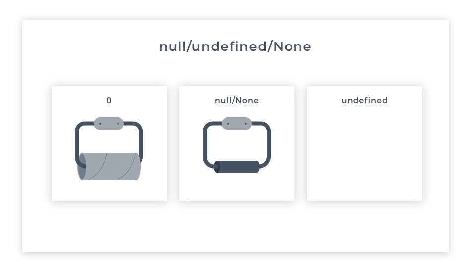

# Imperative Programming Languages

- when working with imperative languages, provide the exact steps to accomplish the outcome;

### Main Concepts
1. Sequence
    - the instructions execute in order written

2. Selection
    - some instructions may or may not execute depending on a condition

3. Iteration
    - some instructions may execute multiple times

### Primitive Data Types

#### Numbers

- Python: floats & ints
- JS: every numbers is a float (JS does not differentiate between them)

#### None, undefined and null
- can be used as fillers where data does not exist yet or where you explicitly want to represent it as <i>nothing</i>:
    - Python:
        - <strong>None</strong> represents the data that is empty;
    - JS:
        - <strong>null</strong> (same as Python's None) represents the data that is empty or non-existent; often used in DBs to represent an empty value in a table, but representing it as an empty string or 0 would be inaccurate;
        
        - <strong>undefined</strong> represent data that does exist in memory but not have been defined as having any value, e.g.: a variable that is declared but have not been assigned any value yet;

- <strong>important</strong> to remember that data that does not exists but does not have any explicit type is <strong>still data</strong>, and therefore it is given a type of either <strong>None</strong>, <strong>null</strong> or <strong>undefined</strong>; 

### Truthy & Falsey Values

The truth of a piece of data might be whether it's positive or negative, whether it has any content, or whether it exists at all.

<th>

<caption>
<strong>Falsy Values Comparison in JS and Python</strong>
</caption>

| Python  |JavaScript   |
|---|---|
|empty sequences (lists, tuples, strings, dics, sets)   |false   |
|zero in every numeric type   |undefined   |
|None   |null   |
|False   |empty string   |
|   |not a number   |
|   |zero   |

### Side Notes
- https://pythontutor.com/ - debugger tool